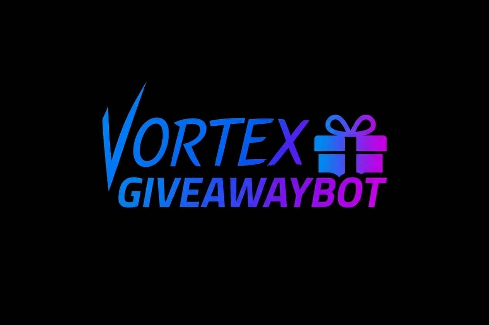

<p align="center">
  
</p>

<h1 align="center">GiveawayBot</h1>

<p align="center">
  <a href="https://github.com/vortexdevelopmentgit/GiveawayBot">
    
  </a>
  <a href="https://github.com/vortexdevelopmentgit/GiveawayBot/network/members">
    
  </a>
  <a href="https://discord.py.dev/">
    
  </a>
  <a href="https://github.com/vortexdevelopmentgit/GiveawayBot/blob/main/LICENSE">
    
  </a>
</p>

---

**GiveawayBot** is a feature-rich, modern Discord bot designed to handle giveaways with precision and style. Built using `discord.py` and utilizing Discord's latest UI components like **LayoutViews**, **Containers**, and **Modals**, it offers a seamless experience for both hosts and participants.

## ✨ Features

- 🚀 **Interactive Creation:** Use Discord Modals to set up giveaways quickly with custom prizes, durations, and colors.
- 📄 **Template System:** Save your favorite giveaway configurations as templates and reuse them with a single command.
- 📋 **Advanced Requirements:** Restrict entries based on roles, leveling (integration ready), or message activity (daily, weekly, monthly, or total).
- ⚙️ **Robust Settings:** Configure manager roles, logging channels, ping roles, and winner DM notifications per server.
- 🔄 **Winner Management:** Easily re-roll winners for ended giveaways or end active ones prematurely.
- 🗄️ **Persistent Storage:** Powered by `aiosqlite` to ensure all data is safely stored and giveaways survive bot restarts.
- 🎨 **Modern UI:** Beautifully formatted messages using the latest Discord UI features for a premium feel.

## 🛠️ Commands

### Giveaway Management
- `/gcreate` — Open an interactive modal to start a new giveaway.
- `/gend [message_id]` — End an active giveaway immediately.
- `/greroll [message_id]` — Draw new winners for an ended giveaway.
- `/glist` — View all active giveaways in the server.
- `/ginfo [message_id]` — Detailed information and entry requirements for a specific giveaway.
- `/gdelete [message_id]` — Remove an ended giveaway from the database.

### Templates (`/gtemplate`)
- `/gtemplate save` — Save a giveaway configuration for future use.
- `/gtemplate use` — Quickly start a giveaway using a saved template.
- `/gtemplate list` — Browse and manage your server's templates.
- `/gtemplate delete` — Remove a saved template.

### Configuration (`/gset`)
- `/gset view` — Display the current server configuration.
- `/gset managerrole` — Define who can manage giveaways without Administrator permissions.
- `/gset logchannel` — Set a channel for giveaway result logs.
- `/gset pingrole` — Choose a role to be notified when giveaways start.
- `/gset dmwinners` — Toggle whether winners receive a private message.

### Utility
- `/help` — Show the interactive help menu.
- `/ping` — Check the bot's latency.

## 🚀 Installation & Setup

1. **Clone the repository:**
   ```bash
   git clone https://github.com/vortexdevelopmentgit/GiveawayBot.git
   cd GiveawayBot
   ```

2. **Install dependencies:**
   ```bash
   pip install -r requirements.txt
   ```

3. **Configure Environment:**
   - Rename `.env.example` to `.env`.
   - Add your [Discord Bot Token](https://discord.com/developers/applications).
   ```env
   BOT_TOKEN="YOUR_DISCORD_BOT_TOKEN_HERE"
   ```

4. **Run the Bot:**
   ```bash
   python main.py
   ```

## 📦 Requirements

- `Python 3.10+`
- `discord.py`
- `aiosqlite`
- `python-dotenv`

## 🤝 Contributing

Contributions are welcome! Feel free to open issues for bugs or feature requests, or submit pull requests to improve the codebase.

---

<p align="center">
  Developed with ❤️ by <a href="https://github.com/vortexdevelopmentgit">Vortex Development</a>
</p>
